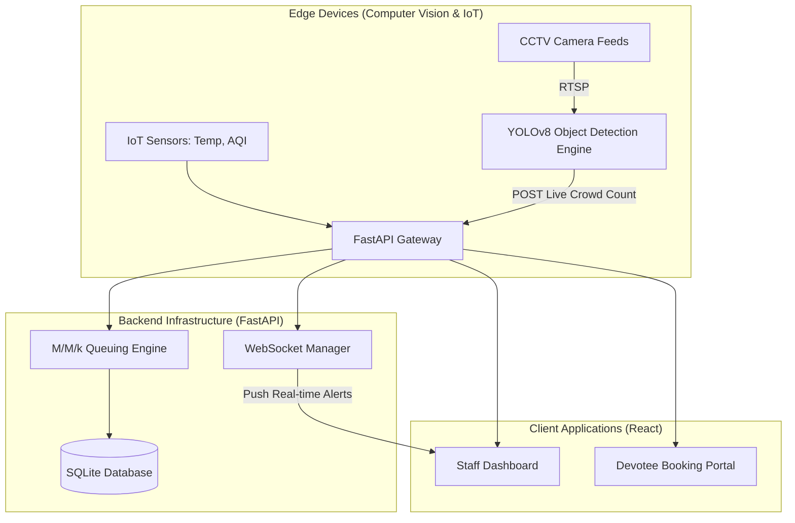

# System Architecture: Smart Temple Crowd Management

This document outlines the high-level architecture and data flow of the Smart Temple system.

## 1. High-Level Architecture Diagram

## 2. Core Components

### A. Edge Computer Vision (Python, OpenCV, YOLOv8)
*   **Role**: Processes video streams in real-time to extract the number of physical devotees in the temple premises.
*   **Mechanism**: Uses Ultralytics YOLOv8 for object detection and ByteTrack for assigning unique IDs to individuals, preventing double-counting.
*   **Optimization**: Configured to run `yolov8n.pt` (Nano) for high FPS even on CPU/Edge devices.

### B. Core Backend Engine (Python, FastAPI, SQLAlchemy)
*   **Role**: The central nervous system of the application.
*   **Endpoints**: Handles REST APIs for slot booking, token generation, and queue management.
*   **WebSockets**: Maintains persistent connections with the Staff Dashboard to push instantaneous CV crowd alerts without heavy HTTP polling.
*   **Auth**: Secures devotee bookings using stateless JWT (JSON Web Tokens).

### C. M/M/k Queuing Theory Load Balancer
*   **Role**: Mathematically models the temple queues.
*   **Variables**: 
    *   `λ (Lambda)`: Arrival rate of devotees.
    *   `μ (Mu)`: Service rate of a darshan counter.
    *   `k`: Number of active counters.
*   **Output**: Dynamically calculates Expected Queue Length ($L_q$) and Expected Waiting Time ($W_q$). It uses this data to decide whether to pull the next token from the "Online" or "Walk-in" queue to maintain strict fairness.

### D. Frontend Interface (React, Vite, TailwindCSS)
*   **Role**: Two-pronged UI for Devotees and Temple Staff.
*   **Devotee Portal**: Allows users to select slots, authenticate, and receive a digital QR Code e-Token.
*   **Staff Dashboard**: Provides a unified, single-pane-of-glass view of IoT metrics, live queue lengths, M/M/k estimations, and flashing CV congestion alerts.
